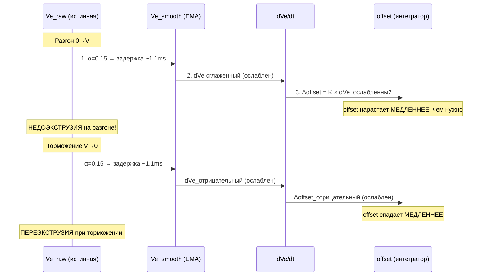

# Аудит алгоритма SPA v4.5-beta2 — Коррекция давления

## 1. Описание проблемы

На основе тестовой печати (PA-башня) выявлено:

| Симптом | Проявление |
|---------|-----------|
| Недоэкструзия на разгоне | Прорехи в стенках в начале движения |
| Наплыв на входе в угол | Маленький избыток материала |
| Недоэкструзия после угла | Давление нагнетается недостаточно быстро после прохождения угла |
| С увеличением K: старт улучшается, углы ухудшаются | K=0.005→0.30: компромисс не достигается |

---

## 2. Анализ алгоритма

### 2.1 Текущая архитектура

Файл: [`ft_motion.cpp:537-607`](Marlin/src/module/ft_motion.cpp:537)

```
Ve_raw[t] = (E_planned[t] - prev_traj_e) × FTM_FS                  (1)
Ve_smooth[t] = Ve_smooth[t-1] + α × (Ve_raw[t] - Ve_smooth[t-1])  (2) EMA
dVe[t] = Ve_smooth[t] - Ve_prev[t-1]                               (3)
Δoffset[t] = K × dVe[t]                                            (4)
offset[t] = offset[t-1] + Δoffset[t]                                (5) Интегратор
E_corrected[t] = E_planned[t] + offset[t]                           (6)
```

### 2.2 Математический анализ

В установившемся режиме (постоянная скорость V):

```
offset[t] = Σ(K × dVe) = K × Ve_smooth[t] = K × V
```

Это математически эквивалентно Klipper PA: `E_corrected = E_planned + K × V`.

**Однако**, из-за того, что dVe вычисляется от **EMA-сглаженной** скорости, а не от сырой, возникает **задержка фазы**:

```
Ve_raw → [EMA, α=0.15] → Ve_smooth → [dVe/dt] → offset[t]
                                  ↑
                            задержка τ ≈ 1.13 мс
```

### 2.3 Демонстрация задержки



### 2.4 Почему увеличение K не решает проблему

- **Больше K** → быстрее нарастание offset при разгоне ✅
  - Но: **больше K** → сильнее сброс offset при торможении ❌
- Это **фундаментальное ограничение** дифференциальной модели + EMA-задержки

---

## 3. Коренная причина (Root Cause)

### 🔴 Проблема: `dVe` вычисляется от EMA-сглаженной скорости

```
ve_curr_raw_q16 = (e_planned - prev_traj_e) * FTM_FS          // OK
spa_ve_smooth_q16 += alpha * (ve_curr_raw - spa_ve_smooth)     // OK, фильтр
dve_q16 = spa_ve_smooth_q16 - spa_ve_prev_q16                  // ❌ ПРОБЛЕМА!
```

EMA-фильтр (`α = 0.15`) вносит задержку ~1.13 мс при `FTM_FS = 5000 Гц`.  
Затем дифференцирование НЕ восстанавливает фазу — dVe остаётся сдвинутым.

**Следствие:** offset (интегратор) всегда отстаёт от реальной потребности в давлении.

---

## 4. Предлагаемое решение

### 🔧 Вариант A (РЕКОМЕНДУЕТСЯ): Прямая пропорциональность

Заменить интегратор на прямую пропорцию:

```
Вместо:
  offset[t] = offset[t-1] + K × dVe_smooth[t]   // интегратор с задержкой

Сделать:
  offset[t] = K × Ve_smooth[t]                   // прямая пропорция
```

**Преимущества:**
- Мгновенная реакция на изменение скорости (нет задержки интегратора)
- Нет накопления ошибки (нет windup)
- Нет SOFT_CLAMP — достаточно жёсткого клиппирования
- Математически эквивалентно Klipper PA
- Проще код, меньше переменных состояния

**Недостатки:**
- Менее плавное поведение на микро-сегментах (но EMA всё ещё фильтрует Ve)

### 🔧 Вариант B (консервативный): Уменьшить EMA alpha

Просто уменьшить `SPA_EMA_ALPHA` c 0.15 до 0.05-0.01.

**Преимущества:** Минимальные изменения кода  
**Недостатки:** Меньше подавления шума микро-сегментов

### 🔧 Вариант C (продвинутый): dVe от сырой скорости с EMA на offset

```
dVe = Ve_raw[t] - Ve_raw[t-1]               // дифференцирование без задержки
dVe_smooth = EMA(dVe)                        // сглаживание dVe
offset = K × dVe_smooth + offset_prev        // интегратор
```

Сохраняет интегратор, но без фазовой задержки дифференцирования.

---

## 5. Сравнительный анализ

| Критерий | Текущий (v4.5) | Вариант A | Вариант B | Вариант C |
|----------|----------------|-----------|-----------|-----------|
| Задержка реакции | ~1.1ms (EMA+интегратор) | **~0ms** (нет интегратора) | ~0.3ms | ~0.5ms |
| Подавление микро-сегментов | ✅ | ✅ (EMA на Ve) | ⚠️ слабее | ✅ |
| Сложность реализации | базовая | **низкая** | минимальная | средняя |
| Риск windup | есть (soft-clamp) | **нет** | есть | есть |
| Смена K на лету | per-block K | per-block K (то же) | per-block K | per-block K |

---

## 6. План реализации (Вариант A)

### Шаг 1: Изменить алгоритм в [`calc_traj_point()`](Marlin/src/module/ft_motion.cpp:537)

Текущий код (строки 562-606):
```cpp
const int32_t dve_q16 = spa_ve_smooth_q16 - spa_ve_prev_q16;     // dVe от сглаженной
const int64_t pa_delta_q16 = ((int64_t)block_K_q16 * (int64_t)dve_q16) >> 16;
spa_pa_offset_q16 += pa_delta_q16;                                // интегратор
```

Новый код:
```cpp
// Прямая пропорция: offset = K × Ve_smooth
const int64_t pa_offset_new_q16 = ((int64_t)block_K_q16 * (int64_t)spa_ve_smooth_q16) >> 16;

// Клиппинг (жёсткий, без soft-clamp)
if (pa_max_offset_q16 > 0) {
    if (pa_offset_new_q16 > pa_max_offset_q16) spa_pa_offset_q16 = pa_max_offset_q16;
    else if (pa_offset_new_q16 < -pa_max_offset_q16) spa_pa_offset_q16 = -pa_max_offset_q16;
    else spa_pa_offset_q16 = pa_offset_new_q16;
} else {
    spa_pa_offset_q16 = pa_offset_new_q16;
}
```

### Шаг 2: Удалить устаревшие переменные

- `spa_ve_prev_q16` — больше не нужен (нет dVe)
- `SPA_SOFT_CLAMP` — больше не нужен (нет windup)
- `spa_peak_offset_q16` — можно сохранить для телеметрии

### Шаг 3: Обновить [`ftmotion_pa_reset_state()`](Marlin/src/module/ft_motion.cpp:85)

Убрать сброс `spa_ve_prev_q16`.

### Шаг 4: Обновить конфигурацию [`Configuration_adv.h:4939`](Marlin/Configuration_adv.h:4939)

`SPA_SOFT_CLAMP` сделать неактуальным (добавить комментарий).

---

## 7. Риски и контрольные точки

| Риск | Вероятность | Митигация |
|------|------------|-----------|
| Рывки экструдера на микро-сегментах | Низкая | EMA-фильтр Ve сохраняется |
| Потеря шагов на высоких скоростях | Низкая | offset не превышает PA_MAX_P_MM |
| Нелинейность при резкой смене K | Средняя | per-block K уже реализован |
| Переполнение Q16 | Низкая | int64_t для промежуточных |

---

## 8. Файлы для изменения

| Файл | Изменения |
|------|-----------|
| [`ft_motion.cpp:54-93`](Marlin/src/module/ft_motion.cpp:54) | Удалить `spa_ve_prev_q16`, изменить `ftmotion_pa_reset_state()` |
| [`ft_motion.cpp:537-607`](Marlin/src/module/ft_motion.cpp:537) | Заменить алгоритм на прямую пропорцию |
| [`Configuration_adv.h:4936-4939`](Marlin/Configuration_adv.h:4936) | Обновить комментарий `SPA_SOFT_CLAMP` |
| [`docs/SPA_Documentation.md`](docs/SPA_Documentation.md) | Обновить документацию |
