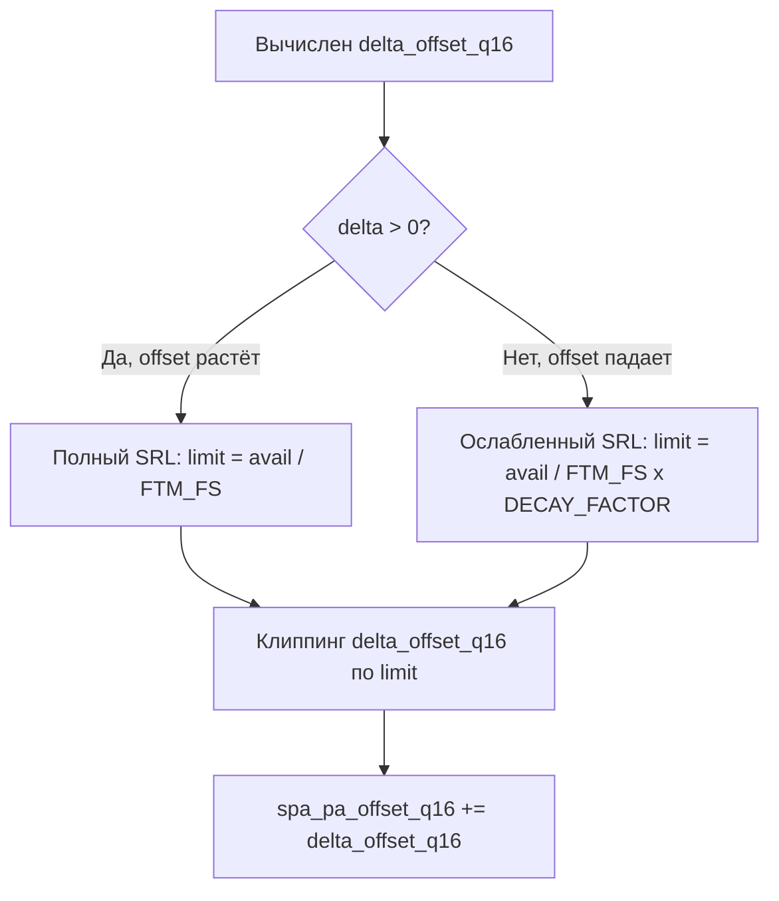

# SPA v4.10 — Асимметричный SRL (исправление микронаплывов на выходе из углублений)

## 1. Описание проблемы

**Симптом**: микронаплыв на всех 4 сторонах тестовой модели k3d_ringing_tower на выходах из углублений (notch). Обычные 90° углы квадрата — без дефектов.

**Root Cause (доказан расчётом)**:

Текущий SRL (Slew Rate Limiter) **симметричен** — ограничивает скорость изменения offset одинаково:
- **offset растёт** — защищает от пропуска шагов
- **offset падает** — физически не нужно, замедление подачи безопасно

SRL создаёт фиксированный **абсолютный lag ~0.003mm** между реальным offset и целевым при торможении. Проблема в **относительной величине** этого lag:

| Условие | Nominal offset | Lag 0.003mm | Относительная ошибка |
|---------|:-:|:-:|:-:|
| Обычная стена (Ve=2.687mm/s) | 0.134mm | +0.003mm | **2.2%** — невидимо |
| Notch exit (Ve=0.28mm/s, 90° угол) | 0.014mm | +0.003mm | **21%** — микронаплыв |
| J=0.03, notch exit (Ve=0.40mm/s) | 0.020mm | +0.003mm | **15%** — всё ещё заметно |

## 2. Решение: Асимметричный SRL



## 3. Edge case: avail <= 0 (Ve >= Vf_max)

Если текущая Ve превышает Vf_max, `avail = Vf_max - |Ve|` <= 0.

Текущий код даёт `max_delta_frame_q16 = 0`. Если мы просто умножим 0 на DECAY, падение offset тоже заблокируется → **залипание offset** в overspeed-ситуации.

**Решение**: гарантировать базовый лимит `Vf_max / FTM_FS` для ветки падения offset, даже при avail <= 0:

```cpp
const int64_t max_delta_frame_q16 = (avail_q16 > 0)
  ? avail_q16 / int64_t(FTM_FS)
  : spa_v_filament_max_q16 / int64_t(FTM_FS);  // base = Vf_max/FS при overspeed
```

Таким образом при avail <= 0:
- offset растёт: `limit = Vf_max/FS ~ 0.0015mm/кадр` (почти ноль — безопасно)
- offset падает: `limit = 0.0015 * 8 = 0.012mm/кадр` (60mm/s — быстро выходит из overspeed)

## 4. Итоговый код

### `Configuration_adv.h` (строки ~4965)
```cpp
// Коэффициент асимметрии SRL (v4.10).
// При delta_offset > 0 (Ve растёт): полный SRL = avail/FTM_FS — защита от stall.
// При delta_offset < 0 (Ve падает): SRL ослаблен в SPA_SRL_DECAY_FACTOR раз.
// Снижение offset безопасно — это замедление подачи филамента.
// Значение 8 = lag 0.0004mm на 90° угле, ошибка 2.6% (невидимо).
#define SPA_SRL_DECAY_FACTOR       8     // 4=консервативно, 32=агрессивно
```

### `ft_motion.cpp` (строки 567-587)
```cpp
// (4) Asymmetric Dynamic Volumetric Slew Rate Limiter (SPA v4.10).
//     offset растёт: жёсткий лимит avail/FTM_FS — защита от stall.
//     offset падает: ослабленный лимит avail/FTM_FS * DECAY — микронаплывы.
if (spa_v_filament_max_q16 > 0) {
  const int64_t ve_abs_q16 = (ve_curr_q16 >= 0) ? ve_curr_q16 : -ve_curr_q16;
  const int64_t avail_q16 = spa_v_filament_max_q16 - ve_abs_q16;

  // max_delta_frame_q16: базовый лимит на один кадр.
  // При avail <= 0 используем Vf_max/FTM_FS как fallback,
  // чтобы offset мог снижаться в overspeed (безопасный выход).
  const int64_t max_delta_frame_q16 = (avail_q16 > 0)
    ? avail_q16 / int64_t(FTM_FS)
    : spa_v_filament_max_q16 / int64_t(FTM_FS);

  if (delta_offset_q16 > 0) {
    // Offset растёт: полный SRL — защита от пропуска шагов
    if (delta_offset_q16 > max_delta_frame_q16)
      delta_offset_q16 = max_delta_frame_q16;
  }
  else {
    // Offset падает: ослабленный SRL
    // Замедление подачи безопасно — нет риска пропуска шагов
    const int64_t decay_limit_q16 = max_delta_frame_q16 * (int64_t)SPA_SRL_DECAY_FACTOR;
    if (delta_offset_q16 < -decay_limit_q16)
      delta_offset_q16 = -decay_limit_q16;
  }
}
```

### `Version.h`
```cpp
#define SHORT_BUILD_VERSION "SPA-v4.10"
```

### `docs/SPA_Documentation.md`
- Раздел SRL: описание асимметрии
- Псевдокод: обновлённая секция (T5)
- Добавить: раздел "Микронаплывы на выходах из углублений — решение v4.10"

## 5. Порядок реализации

| # | Файл | Изменение |
|---|------|-----------|
| 1 | `Configuration_adv.h:4965` | Добавить `SPA_SRL_DECAY_FACTOR 8`, обновить версию в шапке секции |
| 2 | `ft_motion.cpp:567-597` | Заменить симметричный SRL на асимметричный + fallback для avail<=0 |
| 3 | `Version.h:28` | `SPA-v4.9` → `SPA-v4.10` |
| 4 | `docs/SPA_Documentation.md` | Обновить документацию: асимметрия SRL, микронаплывы |

## 6. Todo list

- [ ] **Config**: Добавить `SPA_SRL_DECAY_FACTOR 8` в `Configuration_adv.h:4965`, обновить заголовок секции
- [ ] **Core**: Модифицировать SRL в `ft_motion.cpp:567-597` — асимметричный лимит + fallback для overspeed
- [ ] **Version**: Обновить `SHORT_BUILD_VERSION` на `SPA-v4.10` в `Version.h:28`
- [ ] **Docs**: Обновить `docs/SPA_Documentation.md` — описание асимметрии, обновлённый псевдокод
