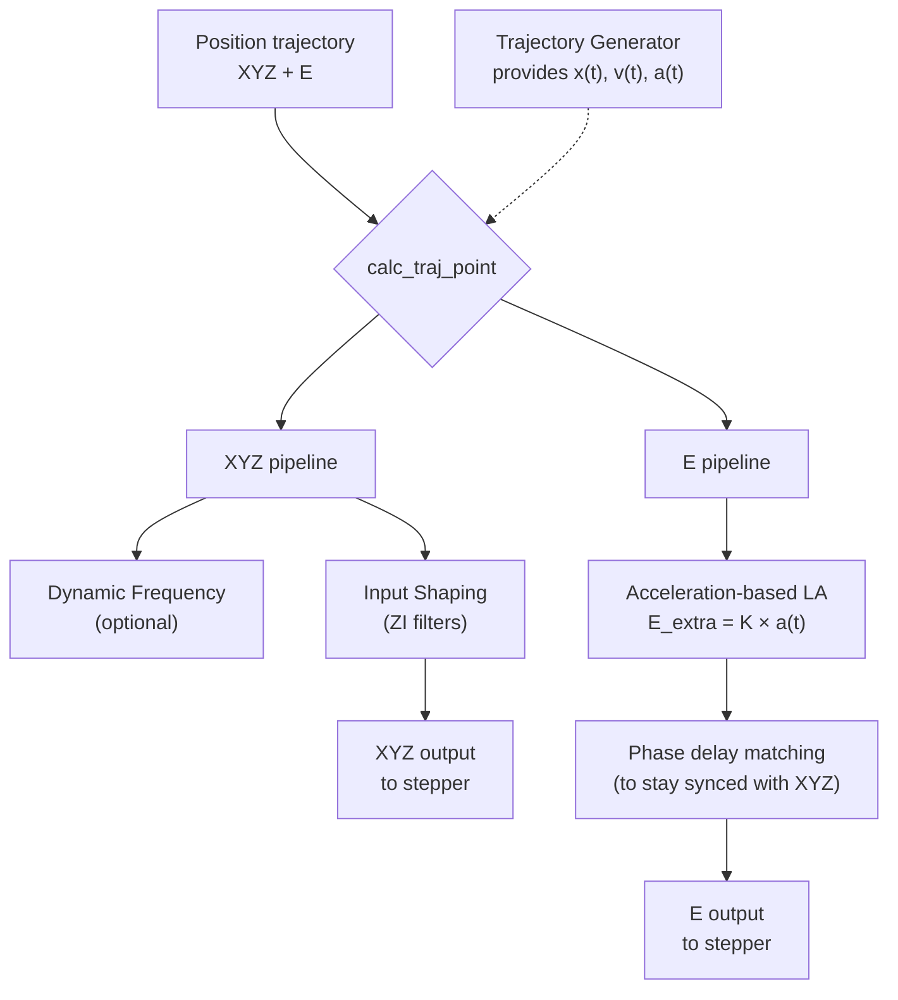

# Dual-Pipeline Hypothesis for Linear Advance in FT Motion — Audit Request

## Context

This document describes a proposed architectural change to Marlin's **Fixed-Time Motion** subsystem to fix **Linear Advance** (pressure advance) when used with FT Motion enabled. The request is for an expert AI audit: critique the hypothesis, identify flaws, suggest alternatives, and flag any overlooked constraints.

## Codebase Reference

- Branch: `bugfix-2.1.x` (recent)
- Commit: `dfc01e2` — FTM_SMOOTHING removed, FTM_CONSTANT_JOLT removed, Poly5 is default trajectory
- Key files:
  - [`Marlin/src/module/ft_motion.cpp`](../Marlin/src/module/ft_motion.cpp)
  - [`Marlin/src/module/ft_motion.h`](../Marlin/src/module/ft_motion.h)
  - [`Marlin/src/module/planner.cpp`](../Marlin/src/module/planner.cpp) (lines 2397–2423 for LA enable logic)
  - [`Marlin/src/inc/SanityCheck.h`](../Marlin/src/inc/SanityCheck.h) (FTM + SMOOTH_LIN_ADVANCE forbidden)
  - [`Marlin/src/inc/Conditionals-adv.h`](../Marlin/src/inc/Conditionals-adv.h) (FTM_HAS_LIN_ADVANCE definition)

## Current Pipeline Architecture

The current [`FTMotion::calc_traj_point()`](../Marlin/src/module/ft_motion.cpp:429) processes ALL axes through a single pipeline:

```
position(t) → LA (E only, velocity-based) → dynFreq update → shaping (all axes, ZI filter) → output
```

### Current LA Implementation (lines 434–460)

```cpp
const float traj_e_delta = traj_e - prev_traj_e;
const float e_rate = traj_e_delta * FTM_FS;  // extruder velocity (mm/s)
traj_coords.e += e_rate * planner.get_advance_k();
```

This is a **velocity-based** model: `E_extra = K × v(t)`. The extruder extra is proportional to instantaneous velocity.

### Current Shaping Implementation (lines 505–536)

The ZI (Zero-Input) shaper applies echo pulses to ALL axes including E:

```cpp
auto _shape = [&](const AxisEnum axis, axis_shaping_t &shap) { ... };
#define _SHAPE(A) _shape(_AXIS(A), shaping.A);
SHAPED_MAP(_SHAPE);  // Includes E if FTM_SHAPER_E is enabled
```

Shaping introduces controlled echos: `output(t) = Σ Aᵢ × input(t - τᵢ)`. For XYZ this cancels mechanical vibrations. For E, the echos cause physical filament back-and-forth which manifests as surface artifacts.

## Problem Statement

Two independent defects make LA unusable with FT Motion:

### Defect 1: Velocity-Based LA (Wrong Physics)

The correct physical model for pressure advance is:

```
E_extra(t) = K × a(t)
```

where `a(t)` is the extruder acceleration. At cruise (a=0), correction should be zero. The velocity model `E_extra = K × v(t)` produces **constant over-extrusion at cruise speed**, which scales with speed:

| Segment Type | a(t) | v(t) | Velocity LA | Acceleration LA |
|---|---|---|---|---|
| Acceleration | >0 | increasing | under-extrudes | correct |
| Cruise | 0 | constant | **constant over-extrude** | **zero (correct)** |
| Deceleration | <0 | decreasing | over-extrudes | correct |
| Stop | — | 0 | zero | zero |

### Defect 2: Shaping Applied to E Axis (Extrusion Artifacts)

Input shaping creates echo pulses with alternating positive/negative gains. Applied to XYZ, these cancel structural ringing. Applied to E:

- Positive echo → extra filament extrusion → blob
- Negative echo → filament retraction → gap
- Net effect: high-frequency extrusion oscillation visible on the print surface

The shaping delay compensation (`axis_sync_enabled` with `max_total_delay`) keeps XYZ and E in temporal sync, but the E axis shaping artifacts remain.

## Proposed Solution: Dual-Pipeline Architecture

### Conceptual Diagram



### Key Architectural Changes

#### A. Acceleration-Based LA

Replace velocity-based LA with acceleration-based. The trajectory generators already compute acceleration internally (Poly5/Poly6 have closed-form second derivatives). We need to expose the acceleration value for the E axis at each trajectory point.

For trapezoidal generator: acceleration is piecewise constant (±a_max, 0).

For Poly5: `a(t) = 20·Δ·t³/T⁵ - 20·Δ·t²/T⁴ + 10·Δ·t/T³`

where Δ is the axis displacement and T is the block duration.

**Implementation sketch:**

```cpp
// During plan_next_block, store:
float traj_duration;          // T
xyze_float_t traj_delta;      // Δ per axis

// In calc_traj_point, compute acceleration:
float t_norm = dist / traj_duration;  // normalized time 0..1
float e_accel = poly5_accel(t_norm, traj_delta.e, traj_duration);

// Apply acceleration-based LA:
float extra_e = e_accel * planner.get_advance_k();
traj_coords.e += extra_e;
```

#### B. E-Axis Bypass of Shaping

Modify `calc_traj_point()` to exclude E from the shaping pipeline:

```cpp
// Current:
#define _SHAPE(A) _shape(_AXIS(A), shaping.A);
SHAPED_MAP(_SHAPE);  // Applies to all shaped axes including E

// Proposed:
#define _SHAPE_XYZ(A) _shape(_AXIS(A), shaping.A);
CARTES_MAP(_SHAPE_XYZ);  // Only XYZ axes
// E is NOT shaped
```

The shaping delay compensation in `axis_sync_enabled` mode would need rework: E has no shaping delay, so it needs an artificial delay to stay synchronized with shaped XYZ axes.

#### C. Phase Delay Compensation

When shaping is enabled on XYZ but not E, the shaped XYZ outputs lag behind the unshaped E output by the shaping centroid delay. Compensation approaches:

1. **Delay E output by `largest_delay_samples` frames** — simplest, E just waits extra frames before outputting
2. **Use a ring buffer on E** — store E values, replay them with the required delay
3. **Delay all axes by the same amount** — add delay to E to match XYZ's centroid delay

Approach 1 is most straightforward:

```cpp
// In fill_stepper_plan_buffer or stepping:
// E gets delayed by shaping_lag = shaping.largest_delay_samples frames
// This ensures traj_coords.e(t) is output at the same real time as shaped XYZ(t)
```

#### D. LA-on-E vs Shaping Conflict Resolution

The current ordering is: `LA → shaping`. With dual pipeline this becomes:

```
XYZ: position → shaping → output
  E: position → LA → phase_delay → output
```

The LA computation on E happens on the **unshaped** raw trajectory, which is correct — LA should compensate for the raw extrusion demand, not the shaped demand.

### Required Changes (Summary)

| File | Change | Risk |
|---|---|---|
| `trajectory_generator.h` | Add virtual `getAccel(t)` method | Low |
| `trajectory_poly5/6.h` | Implement `getAccel()` (closed-form 2nd derivative) | Low |
| `trajectory_trapezoidal.h` | Implement `getAccel()` (piecewise constant) | Low |
| `ft_motion.h` | Add phase delay buffer for E, remove E from SHAPED_MAP | Medium |
| `ft_motion.cpp:calc_traj_point()` | Rewrite E pipeline: accel LA + shaping bypass | **High** |
| `ft_motion.cpp:fill_stepper_plan_buffer()` | Apply phase delay to E output | Medium |
| `ft_motion.cpp:calc_runout_samples()` | Update to not include E's runout if E is unshaped | Low |
| `ft_motion.cpp:ensure_extruder_float_precision()` | Update offset logic for delayed E buffer | Low |
| `SanityCheck.h` | Remove `SMOOTH_LIN_ADVANCE` × `FT_MOTION` static_assert | Low |
| `planner.cpp` | LA enable logic unchanged (FTM_HAS_LIN_ADVANCE still works) | None |

### Testing Strategy

1. **Unit test**: compare velocity-based vs acceleration-based LA output for a known Poly5 trajectory
2. **Simulation**: feed a triangle-wave velocity profile, verify LA output is zero at cruise
3. **Print test**: single-wall cube at varying speeds, compare surface quality
4. **Shaping test**: with M493 shaper enabled, compare E shaping artifacts before/after

## Questions for Audit

1. **Acceleration source**: Is extracting acceleration from trajectory generators the right approach, or should we compute acceleration numerically from the position sequence (central difference: `a[n] = (x[n+1] - 2*x[n] + x[n-1]) * FTM_FS²`)?

2. **Phase delay compensation**: Is a ring buffer on E the best approach, or should we use `ftm_zmax`-sized delay line (same as shaping uses for XYZ)?

3. **Dynamic frequency interaction**: When `dynFreqMode_MASS_BASED` uses `traj_coords.e` to modulate XYZ shaping frequency, how does the E-acceleration-based LA interact with this feedback loop?

4. **SMOOTH_LIN_ADVANCE removal**: The current SanityCheck forbids `SMOOTH_LIN_ADVANCE` with `FT_MOTION`. With acceleration-based LA, should we re-enable it? (Probably not — SMOOTH_LIN_ADVANCE is a standard-motion feature incompatible with FT Motion's fixed-time architecture.)

5. **Retract handling**: Current LA is skipped for retracts (`use_advance_lead` check). With acceleration-based LA, should retracts still be excluded, or could acceleration-based LA handle retracts correctly?

6. **K-factor portability**: Currently LA K values are tuned for standard motion. Will acceleration-based LA K values be numerically different from velocity-based LA K values? If so, by what factor?

7. **Performance impact**: Adding `getAccel()` virtual call per trajectory point adds overhead. Is this acceptable at 1kHz (FTM_FS)? Should we template the trajectory generator to avoid virtual dispatch?

8. **Simpler alternative**: Could we approximate acceleration-based LA by applying a high-pass filter (differentiator + low-pass) to the existing velocity-based LA signal, without touching trajectory generators?

## Current Compilation Status

After the recent cleanup:
- CONSTANT_JOLT: removed — OK
- FTM_SMOOTHING: removed — OK
- Remaining unused files to clean up:
  - `constant_jolt_math.h`
  - `constant_jolt_planner.cpp`
  - `constant_jolt_planner.h`
  - `trajectory_constant_jolt.cpp`
  - `trajectory_constant_jolt.h`
- SanityCheck still forbids SMOOTH_LIN_ADVANCE with FT_MOTION — to be addressed

---

---

## Audit Results — Expert Consilium

### Participants

| Role | Focus |
|---|---|
| **Д-р Архитектор** | Системная архитектура, производительность MCU, оверхед, управление памятью |
| **Инженер-мехатроник** | Физика экструзии, теория управления, математическая модель LA, K-фактор |
| **Специалист по ЦОС** | Цифровая обработка сигналов, Input Shaping, фазовые задержки, ZI-фильтры |
| **Адвокат дьявола** | QA, интеграция в Marlin, граничные случаи, регрессия |

### Round 1: Positions and Arguments

| Expert | Position |
|---|---|
| **Д-р Архитектор** | Поддерживаю разделение пайплайнов, но виртуальный вызов `getAccel()` на 1кГц создаст неприемлемый оверхед на 8/32-битных MCU; необходима реализация через `inline` или шаблоны |
| **Инженер-мехатроник** | `E_extra = K × a(t)` физически корректен и решит проблему переэкструзии на крейсерской скорости, но K-фактор изменит размерность, потребуется полная перенастройка; ретракты всё равно исключить |
| **Специалист по ЦОС** | Исключение E из Input Shaping — единственно верный путь; фазовую задержку реализовать через существующую `ftm_zmax` delay line |
| **Адвокат дьявола** | ВЧ-фильтр (дифференциатор скорости, вопрос 8) — более безопасная альтернатива без переписывания генераторов; `dynFreqMode_MASS_BASED` может создать нестабильность |

### Round 2: Reactions, Compromises, Weak Points

| Expert | Counter-argument |
|---|---|
| **Д-р Архитектор** → ЦОС и Адвокату | `ftm_zmax` delay line предпочтительнее нового ring buffer. ВЧ-фильтр внесет фазовую задержку и усилит шум квантования; closed-form для Poly5 надежнее, если `inline` |
| **Инженер-мехатроник** → Адвокату | Ретракты обязательно исключить (`use_advance_lead`). Новый K-фактор будет численно отличаться в 10-50x, потребуется обновление калибровочных скриптов |
| **Специалист по ЦОС** → Мехатронику и Архитектору | `dynFreqMode_MASS_BASED` должен читать `traj_coords.e` **до** LA-компенсации, иначе искусственное смещение E исказит расчет частоты |
| **Адвокат дьявола** → всем | `SMOOTH_LIN_ADVANCE` должен остаться запрещенным — он модифицирует планировщик на уровне блоков, ломая детерминизм fixed-time |

### Verdict

> Гипотеза Dual-Pipeline архитектурно обоснована и является правильным направлением для решения описанных дефектов.

### Practical Implementation Recommendations

1. **Источник ускорения**: Отказаться от виртуальных функций. Реализовать `getAccel()` как `inline` или шаблонный метод в конкретных генераторах. Численное дифференцирование (central difference) не рекомендуется из-за шума.

2. **Фазовая задержка**: Использовать существующий механизм `ftm_zmax` delay line для искусственной задержки вывода E, гарантируя синхронизацию без новых буферов.

3. **dynFreqMode_MASS_BASED**: Считывать "сырую" координату E *до* применения LA.

4. **Ретракты и SMOOTH_LIN_ADVANCE**: Ретракты исключить. `static_assert` на SMOOTH_LIN_ADVANCE оставить.

5. **Альтернатива с ВЧ-фильтром**: Отклонить — усилит шум, внесет нелинейные фазовые искажения.

6. **K-фактор**: Изменится численно и по размерности (теперь мм/(мм/с²), не мм/(мм/с)). Пользователям нужна повторная калибровка и примечание в документации.

### Uncertainties

- **Коэффициент масштабирования K-фактора**: Требует эмпирического замера на реальных принтерах для формулы конвертации или нового калибровочного G-кода.
- **Экстремальные ускорения**: Аналитическая формула Poly5 может давать пиковые ускорения, которые при большом K приведут к step overflow. Необходим `clamp` для `extra_e` в `ft_motion.cpp`.
- **Существующие конфигурации**: Пользователи столкнутся с некорректной экструзией при обновлении, если не перенастроят K-factor. Release notes обязательны.
